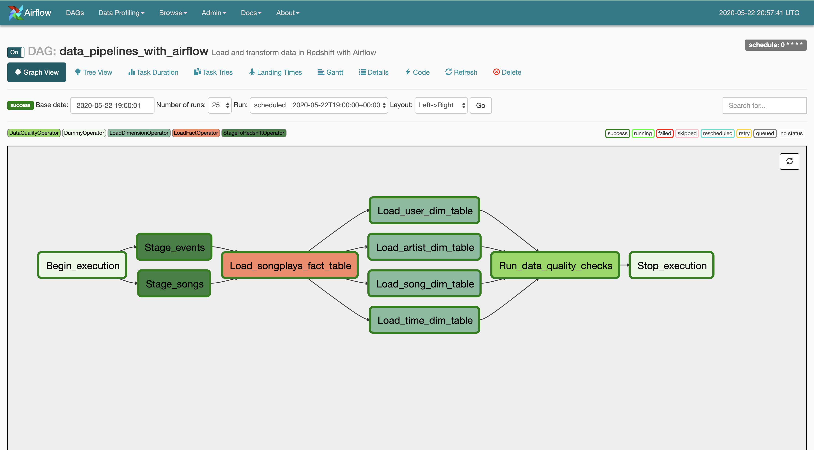

# data-pipelines-with-airflow

## Summary of the Project
This project applies data pipelining (ELT) using Airflow to build pipelines 
to load data to a Redshift cluster.  
The ELT pipeline is mainly responsible for following tasks:
1. Load staging data from S3 files to stage tables in Redshift
2. Transform the raw stage data from these stage tables to a fact table
3. Transform data from the fact table as well as raw stage table to build 
and insert data into modelled dimensional tables
4. Data quality check task to test if these fact and dimensional tables have data
after the completion of tasks mentioned in points 1-3 above. 

 A succesful ELT pipeline as a Airflow DAG run looks like the following snapshot:

# Database Design

### Staging tables:

We create 2 staging tables to copy data as is from AWS S3 buckets.
1. staging_events - to copy data of all user activity from log files present in 'log_data' directory
 in S3 bucket located at 
     > s3://udacity-dend/log_data
2. staging_songs - to copy data of all song tracks prsent in files located at following
S3 destination
    > s3://udacity-dend/song_data
                                                                                                          >

## Data Modeling:

Using the song and log datasets, we create a star schema optimized for queries on song play analysis.

Following is how we modelled the data in 1 fact table and 4 corresponding dimension tables:

### Fact Table:
1. **songplays** - records in log data associated with song plays i.e. records with the page __NextSong__
    - songplay_id, start_time, user_id, level, song_id, artist_id, session_id, location, user_agent
 
### Dimesion Tables:
1. **users** - users in the app
    - user_id, first_name, last_name, gender, level
2. **songs** - songs in music database
    - song_id, title, artist_id, year, duration
3. **artists** - artists in music database
    - artist_id, name, location, latitude, longitude
4. **time** - timestamps of records in songplays broken down into specific units
    - start_time, hour, day, week, month, year, weekday

## Project structure

1. DAG:
This is where we declare tasks within a DAG. For our DAG we have a config defined with
following requirements:
    - The DAG does not have dependencies on past runs
    - On failure, the tasks are retried 3 times
    - Retries happen every 5 minutes
    - Catchup is turned off
    - Do not email on retry  
2. Custom developed Airflow plugins:  
a. Helpers:
   This is where we define our SQL queries for fact and dimensional table inserts  
b. Operators: 
    We define following custom operators:
    1. stage_redshift.py: This is a template operater which accepts as parameters the S3 bucket details from where the 
    data will be loaded and a stage table name to which data will be loaded to.
    We need to provide Airflow 2 connection ids to this operator, one to connect to AWS for S3 access
    and another for access to Redshift. This connections need to be created in the Airflow UI
    2. load_fact.py: This operator transforms data from stage tables to parameter provided fact table 
    In our case we have only fact table, but in case we had modelled more based on the use case, we just need to add
     another task in the DAG with using this operator providing the table name
    3. load_dimesion.py: This operator transforms data from stage tables to parameter provided dimension table. In our case
    we modelled the data in 4 dimension tables and hence we create 4 tasks using this operator in the DAG file
    4. data_quality.py: This is a simple operator querying Redshift to check that data exists in the parameter
     provided table